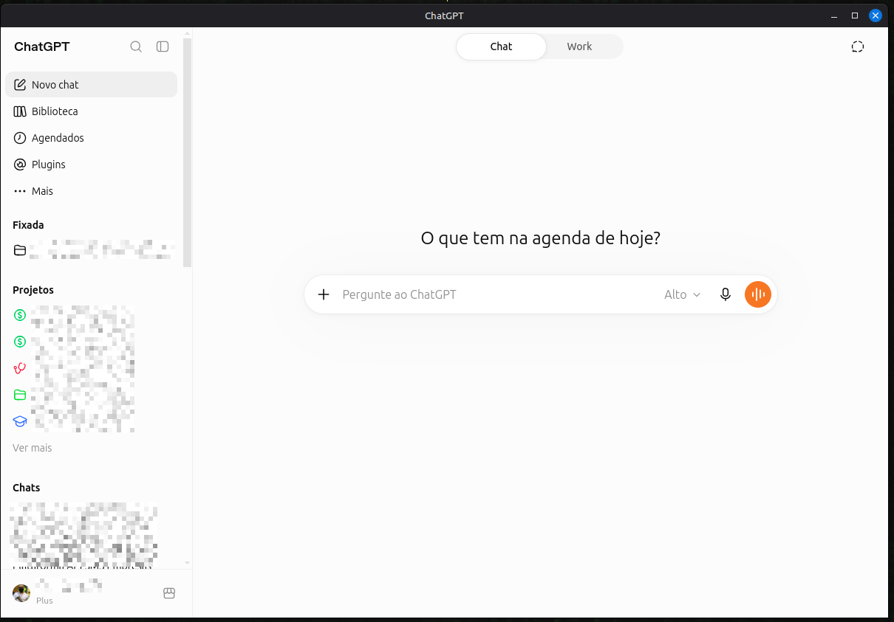
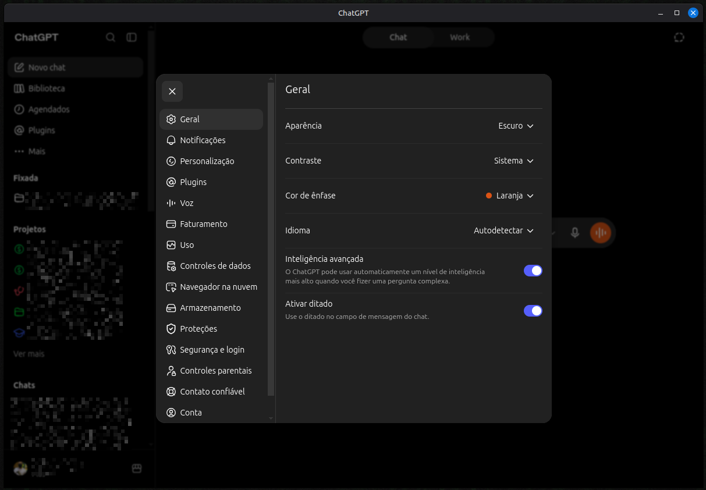
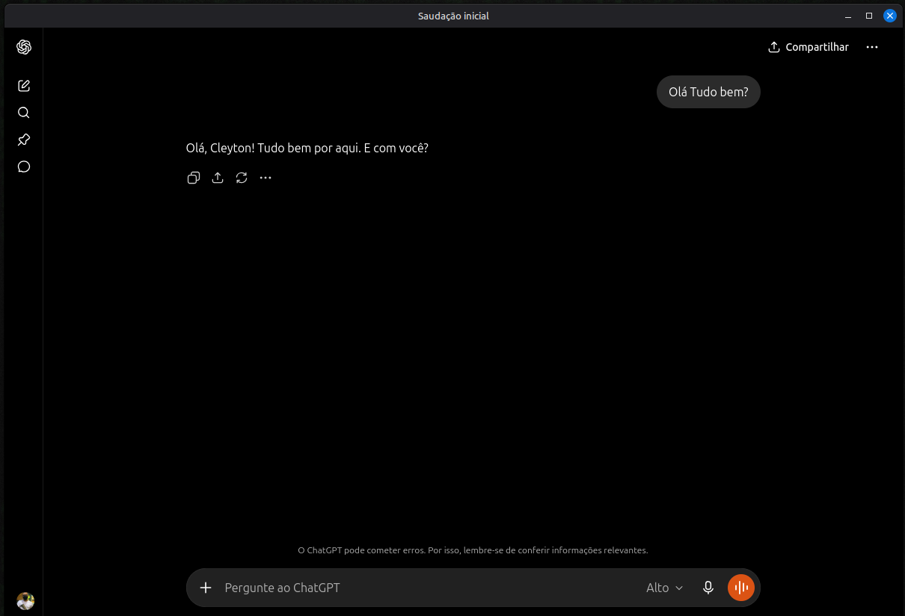
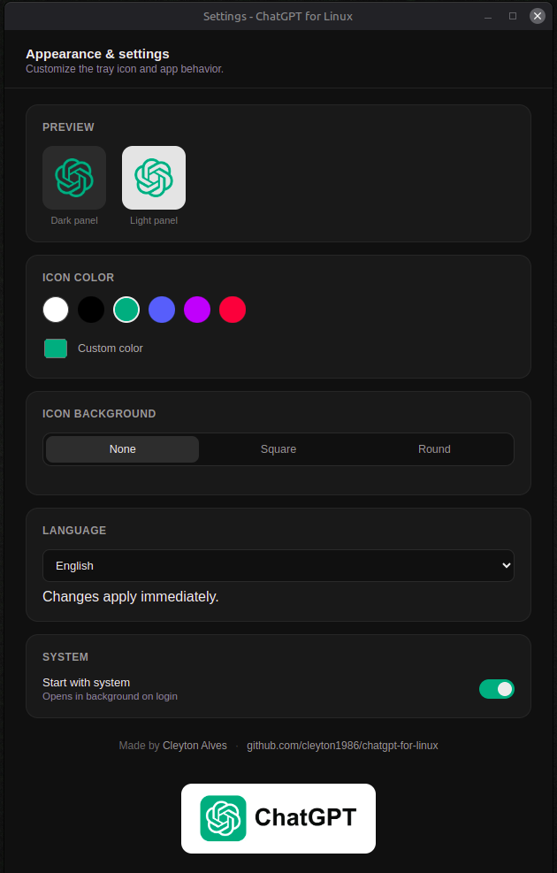

<div align="center">


# ChatGPT for Linux

**Um wrapper desktop nativo, não-oficial e de uso pessoal, do ChatGPT para Linux.**

🇺🇸 [Read in English](README.md)

[-10A37F?style=for-the-badge&logo=debian&logoColor=white)](https://github.com/cleyton1986/chatgpt-for-linux/releases/latest/download/chatgpt-for-linux_0.1.0_amd64.deb)


</div>

---

## ⚠️ Aviso Legal

> **Este é um projeto pessoal, independente e não-oficial, sem qualquer afiliação, endosso, patrocínio ou vínculo oficial com a OpenAI, OpCo, LLC, ou o produto ChatGPT.**
>
> "ChatGPT", "OpenAI" e seus respectivos logotipos e marcas registradas são propriedade exclusiva da OpenAI. Todos os direitos sobre esses nomes, logotipos e ativos de marca são reservados ao seu respectivo proprietário. Este projeto usa o nome e o logotipo do ChatGPT estritamente para fins descritivos e nominativos — para identificar a qual serviço web este wrapper se conecta — e não para reivindicar qualquer afiliação.
>
> Este projeto **não** modifica, faz engenharia reversa, descompila, redistribui ou replica qualquer software, modelo ou serviço da OpenAI de forma alguma. Ele **não contém código-fonte da OpenAI, nenhum ativo proprietário, nem chaves de API ou credenciais pertencentes à OpenAI**. É simplesmente uma janela desktop nativa (construída com Electron/Chromium) que carrega a aplicação web **oficial e publicamente disponível** do ChatGPT em `https://chatgpt.com` — exatamente como qualquer navegador faria. Toda a funcionalidade, conteúdo e dados que você vê vêm diretamente dos próprios servidores da OpenAI, sujeitos aos [Termos de Uso](https://openai.com/policies/terms-of-use) e à [Política de Privacidade](https://openai.com/policies/privacy-policy) da OpenAI.
>
> Este projeto foi criado unicamente porque a OpenAI atualmente não distribui um cliente desktop nativo oficial para Linux, para preencher essa lacuna para uso pessoal e não-comercial, e é compartilhado abertamente caso ajude outras pessoas com a mesma necessidade. Use por sua conta e risco e de acordo com os próprios termos da OpenAI.
>
> Se você é um representante da OpenAI e tem alguma preocupação sobre este projeto, por favor [abra uma issue](https://github.com/cleyton1986/chatgpt-for-linux/issues) e ela será tratada prontamente, incluindo a remoção do projeto caso solicitado.

---

## Por que este projeto existe

O ChatGPT tem apps oficiais para Windows, macOS, iOS e Android — mas **nenhum cliente desktop nativo para Linux**. Este projeto foi feito para uso pessoal, para ter uma janela nativa sempre disponível (bandeja do sistema, sessão persistente, notificação nativa) em vez de manter uma aba do navegador aberta.

É intencionalmente um wrapper simples: nenhuma interface customizada é injetada na própria página do ChatGPT, nenhum dado é interceptado, e nenhuma funcionalidade da aplicação web é alterada. O que a OpenAI distribui na web é exatamente o que você recebe, empacotado como um app desktop.

## Funcionalidades

- 🖥️ **Janela nativa** — sem interface de navegador, sem barra de endereço
- 🔁 **Sessão persistente** — o login sobrevive a reinícios do app (partição `persist:chatgpt`)
- 📌 **Bandeja do sistema** — abrir, nova conversa, recarregar, configurações, sair
- ❌ **Fecha para a bandeja** — fechar a janela apenas a esconde; sua sessão continua ativa em segundo plano
- 🚀 **Instância única** — abrir o app de novo apenas foca a janela existente
- ⚙️ **Iniciar com o sistema** — ativa direto pelo menu da bandeja
- 🔐 **Login OAuth funciona** — popups do Google/Apple/Microsoft abrem corretamente, já que é Chromium de verdade por trás
- 🎙️ **Modo de voz e colar imagem** — permissões de microfone e área de transferência são concedidas onde o ChatGPT precisa
- 🎨 **Ícone da bandeja customizável** — cor, forma do fundo (nenhum / quadrado / redondo) e cor do fundo, tudo configurável com pré-visualização ao vivo
- 🌐 **Interface em vários idiomas** — English (padrão), Português (Brasil), Español, Français, Deutsch, 中文 (简体), 日本語, Русский
- 📦 **Pacotes nativos** — `.deb`, `.rpm`, `pacman` e um AppImage universal

## Screenshots

<div align="center">

**Janela principal**



**Configurações do próprio ChatGPT**



**Conversa**



**Configurações do app (nossas)**



</div>

## Instalação

### Instalador online (recomendado)

```bash
curl -fsSL https://github.com/cleyton1986/chatgpt-for-linux/releases/latest/download/install-online.sh | bash
```

Baixa a versão mais recente da [release](https://github.com/cleyton1986/chatgpt-for-linux/releases/latest) e instala o pacote nativo certo pra sua distro (Debian/Ubuntu, Fedora/openSUSE, Arch), com AppImage como universal.

### Manual (pacote pronto)

Baixe o pacote que bate com sua distro na página de [Releases](https://github.com/cleyton1986/chatgpt-for-linux/releases/latest):

```bash
# Debian / Ubuntu / Mint
sudo apt install ./chatgpt-for-linux_0.1.0_amd64.deb

# Fedora / openSUSE
sudo dnf install ./chatgpt-for-linux-0.1.0.x86_64.rpm

# Arch / Manjaro
sudo pacman -U ./chatgpt-for-linux-0.1.0.pacman

# Qualquer distro (universal)
chmod +x ./chatgpt-for-linux-0.1.0.AppImage
./chatgpt-for-linux-0.1.0.AppImage
```

Desinstalar (a partir do código-fonte):

```bash
./installer/uninstall.sh
```

## Build a partir do código-fonte

```bash
yarn install
yarn start        # roda em modo dev
yarn build         # gera AppImage/deb/rpm/pacman em ./build
./installer/install.sh
```

Build de `.rpm` requer `rpm-build` instalado; `.pacman` requer toolchain Arch (`pacman`/`makepkg`) — se a ferramenta não existir na máquina, `electron-builder` pula esse alvo.

## Atalhos de teclado

- `Ctrl+R` — recarregar
- `Ctrl+W` — esconder janela (continua na bandeja)
- `Ctrl+Shift+O` — nova conversa
- `Ctrl+ +` / `Ctrl+ -` / `Ctrl+0` — zoom

## Como funciona

```
┌──────────────────────────────────────────────────────┐
│  ChatGPT for Linux (processo principal Electron)       │
│  ├─ BrowserWindow ── https://chatgpt.com (Chromium)    │
│  ├─ Partição de sessão persist:chatgpt                  │
│  ├─ Bandeja do sistema (ícone customizável)             │
│  ├─ Janela de configurações (aparência, idioma)          │
│  └─ i18n (en / pt-BR / es / fr / de)                     │
└──────────────────────────────────────────────────────┘
```

## Estrutura do projeto

```
src/
  index.ts               entrypoint, GPU/protocolo
  app-controller.ts       bandeja, autostart, handlers IPC
  main-window.ts          BrowserWindow, sessão, permissões
  config-window.ts         janela de configurações
  i18n.ts                 dicionários de tradução
  module/                 bandeja, atalhos, estado da janela
data/
  config.html             UI da janela de configurações
installer/
  install.sh              instalação local (pacote já buildado)
  install-online.sh        instalação remota (release do GitHub)
  uninstall.sh
```

## Apoie o Projeto

Se este projeto foi útil pra você e quiser apoiar o desenvolvimento, considere pagar um café:

<p align="center">
  <a href="https://www.paypal.com/cgi-bin/webscr?cmd=_donations&business=cleyton1986%40gmail.com&currency_code=BRL&item_name=ChatGPT+for+Linux">
    
  </a>
</p>

<p align="center">
  
</p>

Qualquer contribuição é voluntária e muito bem-vinda!

## Licença

[MIT](LICENSE) — cobre apenas o código do wrapper neste repositório.
ChatGPT, sua aplicação web e todas as marcas relacionadas permanecem propriedade da OpenAI.
